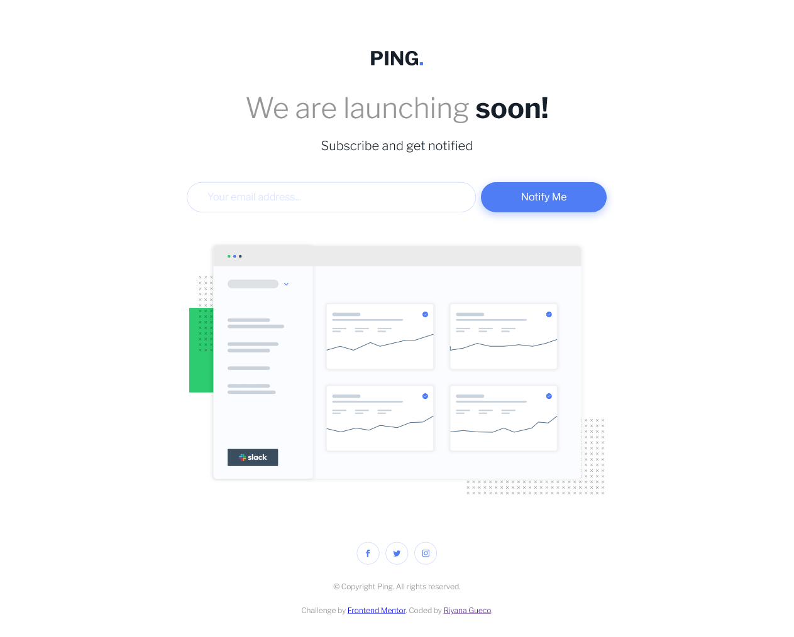
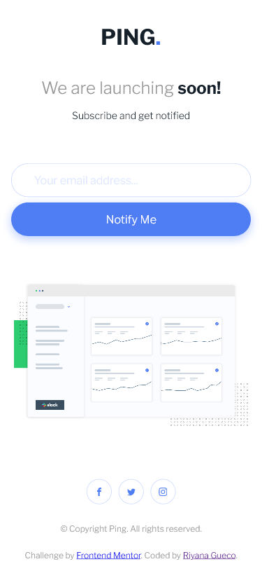

# Frontend Mentor - Ping coming soon page solution

This is a solution to the [Ping coming soon page challenge on Frontend Mentor](https://www.frontendmentor.io/challenges/ping-single-column-coming-soon-page-5cadd051fec04111f7b848da). Frontend Mentor challenges help you improve your coding skills by building realistic projects. 

## Table of contents

- [Overview](#overview)
  - [The challenge](#the-challenge)
  - [Screenshot](#screenshot)
  - [Links](#links)
- [My process](#my-process)
  - [Built with](#built-with)
  - [What I learned](#what-i-learned)
- [Author](#author)
- [Acknowledgments](#acknowledgments)

## Overview

### The challenge

Users should be able to:

- View the optimal layout for the site depending on their device's screen size
- See hover states for all interactive elements on the page
- Submit their email address using an `input` field
- Receive an error message when the `form` is submitted if:
	- The `input` field is empty. The message for this error should say *"Whoops! It looks like you forgot to add your email"*
	- The email address is not formatted correctly (i.e. a correct email address should have this structure: `name@host.tld`). The message for this error should say *"Please provide a valid email address"*

### Screenshot

#### Desktop

### Mobile

### Links

- Solution URL: [https://www.frontendmentor.io/solutions/ping-comng-soon-page-with-html-sass-and-javascript-jwhZOYsgG](https://www.frontendmentor.io/solutions/ping-comng-soon-page-with-html-sass-and-javascript-jwhZOYsgG)
- Live Site URL: [https://rngueco.github.io/frontend-mentor-projects/ping-coming-soon-page/](https://rngueco.github.io/frontend-mentor-projects/ping-coming-soon-page/)

## My process

### Built with

- Semantic HTML5 markup
- CSS custom properties
- Flexbox
- Mobile-first workflow
- Sass

### What I learned

This was sort of an easy challenge layout-wise, but my main goal for this challenge was to implement the client-side validation as cleanly as I could.

The client-side validation flow is as follows:

- Everytime the user focuses out of the input field, the validation check is fired. This is to prevent error messages from displaying when the user hasn't interacted with the form yet or is still in the process of typing.
- If the user doesn't focus out of the field and submits the form directly (i.e. the user pressed the `enter` key after email input), the input is first checked for validity. If valid, the form submits, otherwise an error message appears.

## Author

- Frontend Mentor - [@rngueco](https://www.frontendmentor.io/profile/rngueco)
- Twitter - [@RiyanaGueco](https://www.twitter.com/RiyanaGueco)

## Acknowledgments

Special thanks to [Matt](https://www.frontendmentor.io/profile/mattstuddert) for pointing out UX and accessibility lapses from my first solution.